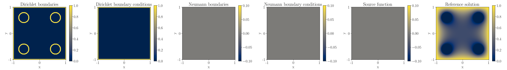
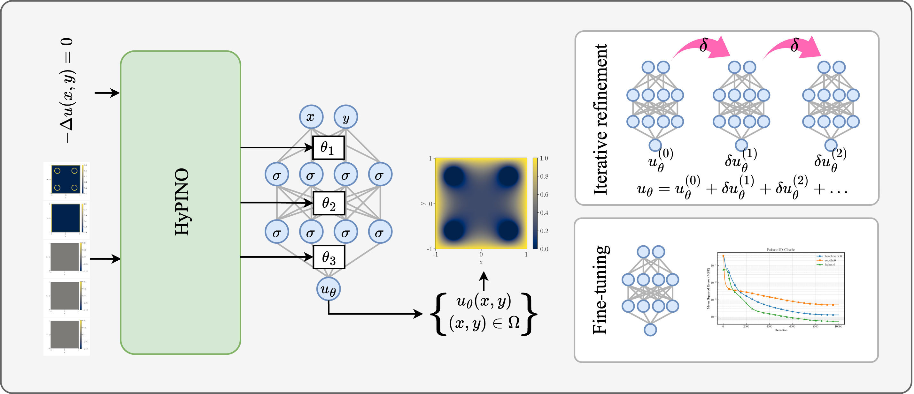

# HyPINO: Multi-Physics Neural Operators via HyperPINNs and the Method of Manufactured Solutions  

<p>
  <a href="https://arxiv.org/abs/2509.05117" target="_blank">
    
  </a>
  <a href="https://huggingface.co/rabischof/hypino" target="_blank">
    
  </a>
  <a href="https://rbischof.github.io/hypino_web/" target="_blank">
    
  </a>
</p>

HyPINO is a **multi-physics neural operator framework** that generalizes across diverse linear, 2D, second-order PDEs in a **zero-shot** manner.  
It uses a **Swin Transformer–based hypernetwork** to generate **Physics-Informed Neural Networks (PINNs)** conditioned on PDE specifications, trained entirely using the **Method of Manufactured Solutions (MMS)**. This repository contains the official implementation of the paper.


## Features  

- **Zero-shot generalization** across linear, 2D, second-order PDE families (elliptic, parabolic, hyperbolic)  
- **Mixed boundary condition support:** Dirichlet, Neumann, and interior boundaries  
- **Swin Transformer hypernetwork** that generates task-specific PINNs  
- **Residual-based iterative refinement** for test-time accuracy improvement  
- **PINN initialization** for faster convergence and improved fine-tuning performance  


## Framework Overview  

As an example, consider the Poisson equation $-\Delta u(x, y) = 0,$ defined on a square domain with **circular inner boundaries**.  
The image below shows the **input fields expected by HyPINO** and their corresponding **reference solutions**.

<p align="center">
  
</p>

Given a PDE specification, HyPINO’s **Swin Transformer hypernetwork** generates the weights of a **target PINN**, which can be evaluated continuously over the spatial domain  
$(x, y) \in [-1, 1]^2$. 

<p align="center">
  
</p>


## Installation  

HyPINO was tested with **Python 3.12.1**.  

Install dependencies:  

```bash
pip install -r requirements.txt
```


## Model Weights  

### HyPINO pretrained model  

Download the pretrained HyPINO model directly from Hugging Face:  

```bash
# Option 1: Using the Hugging Face CLI
hf download rabischof/hypino hypino.safetensors --local-dir models/

# Option 2: Using wget
wget -O models/hypino.safetensors https://huggingface.co/rabischof/hypino/resolve/main/hypino.safetensors
```

## Training  

To train the model:  

```bash
python train.py
```

Logs, checkpoints, and plots are saved under:  

```
runs/
```


## Evaluation  

Evaluate a trained model:  

```bash
python evaluate.py --model hypino --weights models/hypino.safetensors
```


## Example Notebooks  

The `notebooks/` directory contains guided examples for exploring and extending HyPINO:  

| Notebook | Description |
|-----------|--------------|
| `01_visualize_data.ipynb` | Visualizes benchmark PDE inputs and reference solutions. Shows both supervised (MMS-generated) and unsupervised samples. |
| `02_inference.ipynb` | Explains expected HyPINO inputs, output format, and how to use predictions for downstream tasks. |
| `03_iterative_refinement.ipynb` | Demonstrates how to build ensembles of PINNs via residual-based iterative refinement and visualize test-time improvements. |
| `04_pinn_finetuning.ipynb` | Shows how HyPINO-generated PINNs can be used as initialization for PDE-specific fine-tuning. |


## Citation  

If you use this code or model, please cite:  

```bibtex
@article{bischof2025hypino,
  title={HyPINO: Multi-Physics Neural Operators via HyperPINNs and the Method of Manufactured Solutions},
  author={Bischof, Rafael and Bickel, Bernd},
  journal={arXiv preprint arXiv:2509.05117},
  year={2025}
}
```
